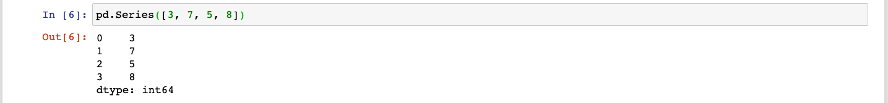
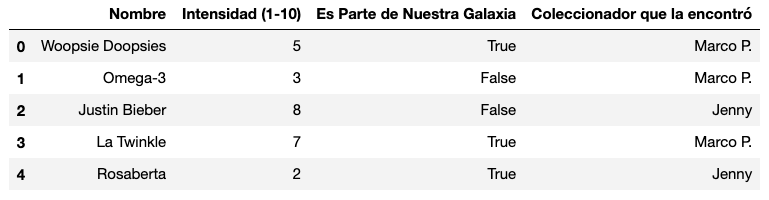

## Sesión 04: Pandas y Análisis Exploratorio de Datos

### 1. Objetivos

1. Identificar las características básicas de las Series y DataFrames de Pandas.
2. Leer JSONs usando Pandas.
3. Utilizar herramientas básicas de exploración de datos.

### 2. Contenido

---

<ins>Paquetes en Python</ins>

Los **Paquetes** en Python es una de las grandes fortalezas de Python ya que hay una cantidad muy grande y cada Paquete ayuda a resolver de forma práctica un tipo de problema.

Muchos parquetes o librerías son mantenidas por la Fundación de Software de Python, la mayoría son mantenidos por la comunidad como en caso de NumPy, Matplotlib o Pandas.

Veamos cómo usarlos.

[**`Ejemplo 1`**](01E-paquetes.ipynb)

---

<ins>Series de Pandas</ins>

Las `Series` son una de las dos estructuras de datos que ofrece `pandas` que nos hacen la vida mucho más fácil como científicos de datos.

Las `Series` son una especie de híbrido entre `listas` y `diccionarios`.

<div style="padding: 10px; margin: 20px"></div>

Vamos a ver cómo funcionan.

[**`Ejemplo y reto 2`**](02ER-series.ipynb)

---

<ins>Dataframes</ins>

Los `DataFrames` son la segunda estructura de datos de `pandas` que vamos estar usando constantemente. Un `DataFrame` está hecho de dos o más `Series` acomodadas de manera que obtenemos una estructura tabular.

Los `DataFrames` son bidimensionales, tienen filas y columnas. Cada columna es una `Serie` que tiene un nombre. Los `DataFrames` nos ayudan a manejar datos en estructura tabular de manera muy eficiente.

<div style="padding: 10px; margin: 20px"></div>

Veamos cómo funcionan.

> 

[**`Ejemplo y reto 3`**](03ER-dataframes.ipynb)

---

<ins>Manipulación de columnas en un `DataFrame`</ins>

Podemos agregar, reasignar y eliminar columnas de nuestros `DataFrames`. La sintaxis es muy parecida a la que se usa con los `diccionarios`.

> 

[**`Ejemplo y reto 4`**](04ER-manipulacion_de_columnas.ipynb)

---

<ins>Lectura de archivos JSON</ins>

Uno de los formatos más comunes en los que vamos a encontrar conjuntos de datos es el formato JSON. Como probablemente ya sabrás, el formato JSON se parece bastante al formato que tienen los `diccionarios` de Python:

```python
{
    "llave_1": "valor_1",
    "llave_2": "valor_2",
    "llave_3": "valor_3",
    "llave_4": "valor_4"
}
```

Vamos a aprender a leer archivos JSON y a convertirlos en `DataFrames`.

> Lectura de CSVs y adquisición de datos por medio de APIs y Bases de Datos se estudian más adelante en el módulo.

[**`Ejemplo y reto 5`**](05ER-lectura_de_json.ipynb)

---

<ins>Análisis Exploratorio de Datos</ins>

El Ánalisis Exploratorio de Datos es el proceso a través del cual exploramos un nuevo conjunto de datos para conocer su contenido a profundidad. Este paso es extremadamente importante, puesto que nos ayuda a saber cómo limpiar y reestructurar nuestro conjunto de datos de manera que podamos realizar un mejor análisis y visualización de los datos.

Vamos a ver algunas herramientas básicas que tienen los `DataFrames` para explorar un conjunto de datos.

> Por ahora estamos haciendo una exploración muy básica. Lo que importa es que el alumno entienda los principios básicos de cómo crear `DataFrames` a partir de conjuntos de datos existentes. En la sesión que sigue se verá Análisis Exploratorio a más profundidad.

[**`Ejemplo y reto 6`**](06ER-aed.ipynb)

---

### 3. Postwork

[**`Postwork Sesión 4`**](07A-Postwork.md)
